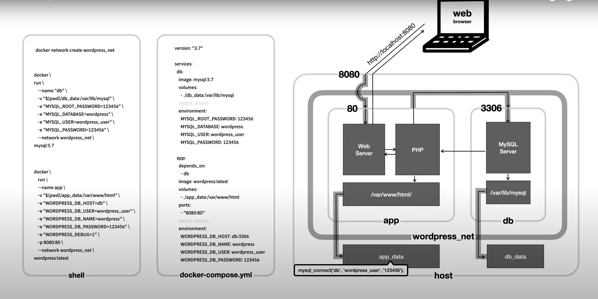

# Inception

## Resume

### Goal :

- Using Docker, deploy a service which can be used in every OS(linux, window, mac OS(intel/M1), ...etc.

### Stacks

- Docker

- Docker Containers:
    
	- NGINX, TLSv1.2(ou 1.3)

	- WordPress + php-fpm(installed and configured)

	- MariaDB without Nginx

- Volume

	- WordPress Database

	- WordPress Files
	
- Docker-network: bind the containers.

### Subject

1. How to use `Dockerfiles` and `PID 1`

2. Two user in WordPress DB

	- one is `Admin` (username doesn't contains hint of administrator like admin-123 ... etc)

	- other is normal user

3. DO NOT use:


	- Dockerhub images like: Wordpress, nginx... etc
		
		=> Use only `Alpine` or `Debian` image

	- hacky patch(not recommanded)

	- host, --link, links
			
		> `network` must be defined in `docker-compose.yml`

	- `infinity loop` such as while true...


## Program

### Packages

- wordpress container:
	- wordpress(maybe not directly 'apt-get install wordpress' but with curl...?)
	- php-fpm(need php d'abord) => php version...?

- nginx container:
	- nginx
	- openssl

- mariadb container :
	- mariadb-server
	- mariadb-client

### Init Containers

1. Mariadb

	```bash
	docker run --name mariadb -it \
	-v $(pwd)/srcs/requirements/mariadb/db_vol:/var/lib/mysql \
	-v $(pwd)/srcs/requirements/mariadb/conf:/tmp/conf \
	-v $(pwd)/srcs/requirements/mariadb/tools:/tmp/tools \
	--env-file $(pwd)/srcs/.env \
	-p 3307:3307 \
	debian
	```
	* 3306 port is in use in my mac => that's why i put 3307 temporally

	1-1. install packages => `RUN`

	```bash
	# Remove old volume db
	# but not need in Dockerfile, in debian:buster image mysql is not installed
	rm -r /var/lib/mysql/* 2> /dev/null
	# Install packages
	apt-get update && apt-get install -y mariadb-server mariadb-client
	```

	1-2. init mariadb => `CMD` or `ENTRYPOINT` in Dockerfile...?


	```bash
	# Init mariadb
	service mysql start;
	
	# create wordpress db
	echo "CREATE DATABASE IF NOT EXISTS $MYSQL_DATABASE" | mysql -u root;
	# create a user with its pw
	# '%' is whild card in mysql but do not use  who '*' use
	echo "CREATE USER IF NOT EXISTS '$MYSQL_USER'@'%' IDENTIFIED BY '$MYSQL_PASSWORD'" | mysql -u root;
	# accord all priv on wordpress db to user
	echo "GRANT ALL PRIVILEGES ON $MYSQL_DATABASE .* TO '$MYSQL_USER'@'%'" | mysql -u root;
	# update privileges
	echo "FLUSH PRIVILEGES" | mysql -u root;


	service mysql stop

	exec /usr/sbin/mysqld -u root
	```

	cf:
	```sql
	# see GRANTS for current user
	SHOW GRANTS;
	# see GRANTS for 'root_root'@'%'; 
	SHOW GRANTS FOR 'root_root'@'%'; 
	```

	for test:
	```bash
	docker build -t mariadb ./srcs/requirements/mariadb
	docker run --name mariadb -it --env-file $(pwd)/srcs/.env -p 3308:3308 mariadb
	```


2.  Nginx


3.  Wordpress

## Theory

### Base commands

0. pull

	> docker pull [DOCKER_IMAGE]
	
	```zsh
	docker pull debian # download docker image from dockerhub
	```

1. run

	> docker run [OPTION] <DOCKER_IMAGE>

	ex:
	```zsh
	docker pull debian # download docker image from dockerhub
	docker run -it debian	# run debian image with interactive mode
	```

	```zsh
	docker run --name ws -p 8000:80 -v ~/Documents/42/inception/src:/usr/local/apache2/htdocs httpd
	```


	```
	docker run --name nginx -it -v $(pwd)/srcs/requirements/nginx/conf:/etc/nginx debian
	```
	
	- `--name <CONTAINER_NAME>` : define container name

	- `-p <HOST_PORT>:<CONTAINER_PORT>`:
		- define port forwarding: in this exemple, when host receive a request to 8000 port, redirect this req to 80 port in ws container.

	- `-v <HOST_FILE_SYSYEM>:<CONTAINER_FILE_SYSTEM>`:
		- link HOST FS and CONTAINER FS
		- Thanks for this, you can edit FS in container from host.

	- `-i` : interactive mode


2. logs

	> docker logs [OPTION] <CONTAINER>


	ex:

	```zsh
	docker logs -f ws3
	```

	- `-f` : follow log output(like watch in nodemon)


3. exec

	> docker exec [OPTION] <CONTAINER> <COMMAND>

	ex01: access to current container then execute one command

	```zsh
	docker exec ws2 pwd #usr/local/appach2
	```

	ex02: open interactive shell(`bash`, `sh` ou `zsh` if container has it) in current container
	
	```zsh
	docker exec -it ws2 bash
	
	root@27290926ed14:/usr/local/apache2# pwd
	/usr/local/apache2

	```
	- `-i` : interactive, keep STDIN open even if not attached
	- `-t` : Allocate a pseudo TTY

4. start

	> docker start <CONTAINER>

5. stop

	> docker stop <CONTAINER>

6. remove container

	> docker rm <CONTAINER>


7. remove image

	> docker rmi <DOCKER_IMAGE>


### Dockerfile & build

```
|------------|
| Dockerfile |
|------------|
        |
        | build 
        v
|--------------|
| DOCKER_IMAGE |
|--------------|
    |   ^
run |   | commit
    v   |
|------------------|
| DOCKER_CONTAINER |
|------------------|
```

- Dockerfile

```Dockerfile
FROM ubuntu
RUN apt update && apt install -y python3
WORKDIR /var/www/
COPY ["src/index.html", "."]
CMD [ "python3", "-u", "-m", "http.server" ]
```
   - `FROM` : reference image
   - `RUN` : command to execute on `build` - on image
   - `WORKDIR` : move to this directory on `build` (if not exist, create it)
   - `COPY` : copy src file to dst path
   - `CMD` : command to execute on `container`


- Build command

```bash
docker build -t web-server .; # build docker image from Dockerfile
docker rm --force ws; # when container exist, remove old container
docker run --name ws -p 8888:8000 web-server; # create/run container from docker image.
```


- docker-compose 



### ETC


### Reference
- [docker-compose by Egoing](https://www.youtube.com/watch?v=EK6iYRCIjYs "Egoing docker-compose class")
